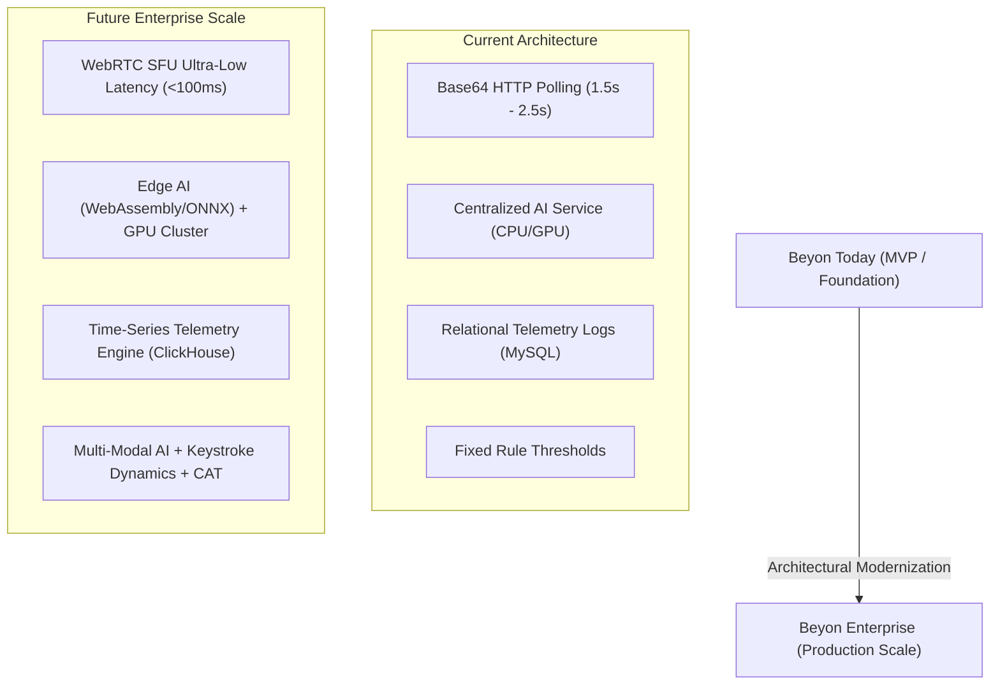
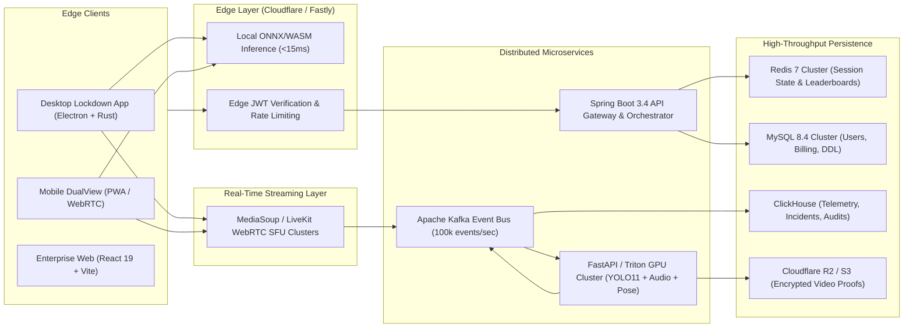
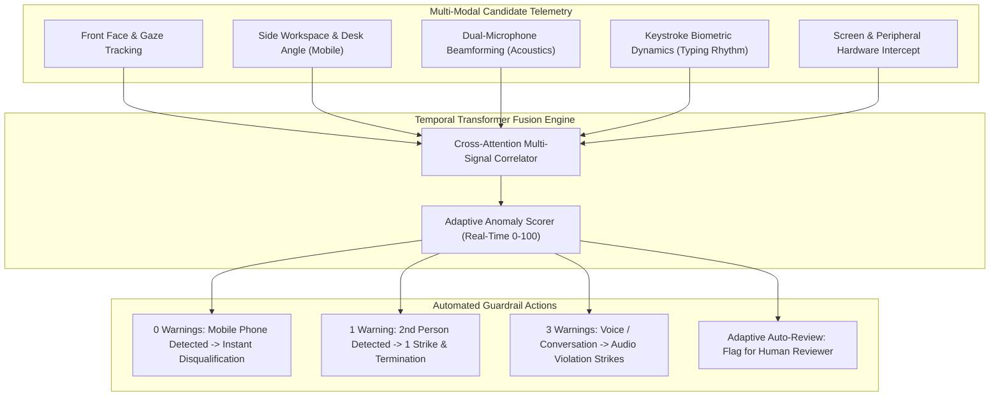
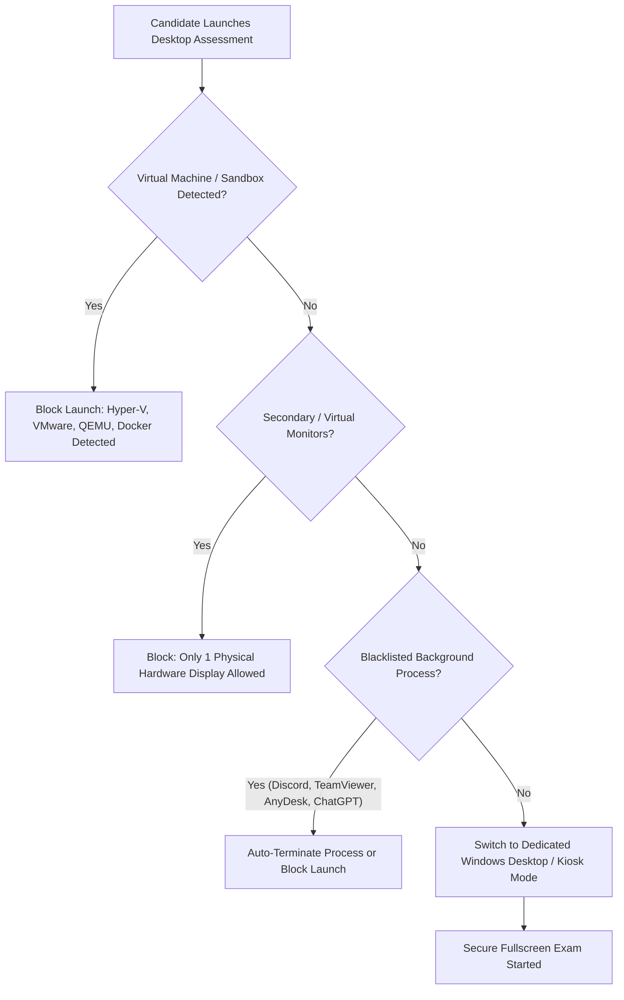
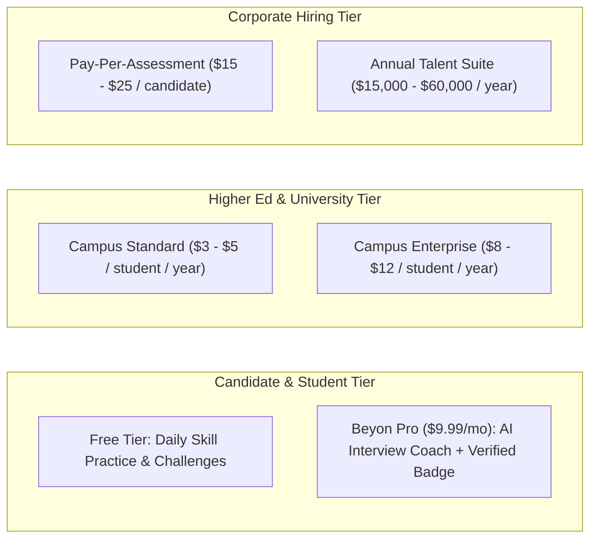
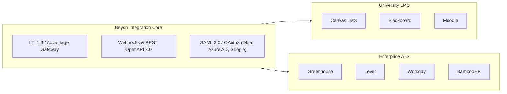
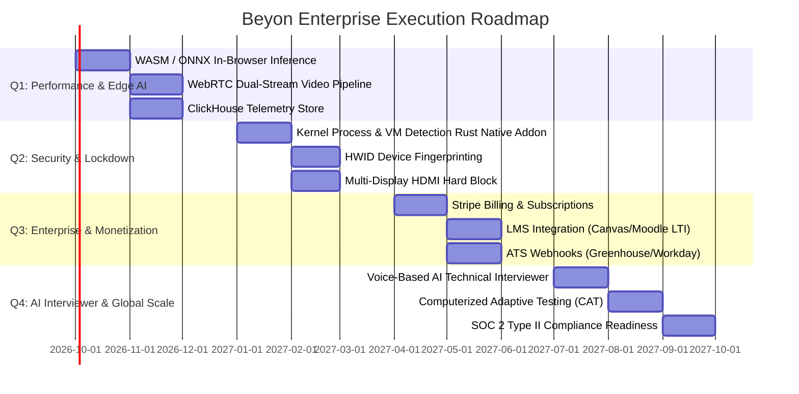

# 🚀 BEYON NEXT-GEN: Enterprise Architecture, Ultra-Low Latency & Monetization Roadmap

> **Transforming the Beyon AI Assessment & DualView Proctoring Platform into a World-Class, Sub-100ms Latency, Zero-Cheat Commercial Enterprise SaaS.**

---

## 📑 Table of Contents
1. [Executive Vision & Target State](#1-executive-vision--target-state)
2. [Ultra-Fast & Scalable System Architecture](#2-ultra-fast--scalable-system-architecture)
3. [AI Proctoring 3.0: Zero-Latency Edge + Multi-Modal AI](#3-ai-proctoring-30-zero-latency-edge--multi-modal-ai)
4. [Enterprise Lockdown Browser & Hardware Security](#4-enterprise-lockdown-browser--hardware-security)
5. [Business Model, Pricing & Subscription Architecture](#5-business-model-pricing--subscription-architecture)
6. [Ecosystem Integrations (LMS, ATS & Cloud)](#6-ecosystem-integrations-lms-ats--cloud)
7. [Compliance, Privacy & Global Accreditations](#7-compliance-privacy--global-accreditations)
8. [Phased Implementation Roadmap (Q1 - Q4)](#8-phased-implementation-roadmap-q1---q4)

---

## 1. Executive Vision & Target State

### Core Performance Benchmarks (KPI Targets)
| Metric | Current State | Enterprise Target | Optimization Strategy |
| :--- | :--- | :--- | :--- |
| **Video Telemetry Latency** | ~1500ms - 2500ms | **< 100ms** | WebRTC Selective Forwarding Units (SFU) with VP9/AV1 encoding |
| **Local Frame Inference** | 120ms - 250ms | **12ms - 25ms** | In-Browser WebAssembly / ONNX Runtime Edge Inference |
| **Concurrent Test Takers** | ~500 concurrent | **100,000+ concurrent** | Distributed Microservices, Redis Cluster, Kafka Event Bus |
| **Telemetry Storage Query** | 400ms (MySQL table) | **< 15ms** | ClickHouse Columnar DB + Redis Caching layer |
| **False Positive Rate** | < 5% | **< 0.1%** | Multi-Modal Sensor Fusion (Camera + Mic + Gaze + Keystrokes) |

---

## 2. Ultra-Fast & Scalable System Architecture

### Key Technical Improvements:
1. **WebRTC SFU (Selective Forwarding Unit)**: Replace HTTP base64 frame POSTs with MediaSoup or LiveKit WebRTC streams. Real-time video is transmitted at 30 FPS using <300 kbps bandwidth with sub-100ms latency.
2. **Apache Kafka Event Bus**: Ingestion of over 100,000 proctoring events per second across thousands of simultaneous candidate sessions without database locking.
3. **ClickHouse for Telemetry Logs**: Optimized for high-speed writes of millions of timestamped facial, gaze, audio, and posture events, reducing recruiter audit report load times from 2s to <20ms.
4. **Rust Native Addon for Electron**: Move lockdown kernel monitoring (display capture hooks, process termination, clipboard guard) into a high-performance native Rust `.node` binary.

---

## 3. AI Proctoring 3.0: Zero-Latency Edge + Multi-Modal AI

### 1. In-Browser Edge Inference (WASM / ONNX)
- Run lightweight models directly inside the candidate's browser using **ONNX Runtime Web with WebGPU / WASM**.
- **Result**: Instantaneous (10ms) face presence and gaze detection with zero server compute costs.

### 2. Keystroke Biometric Verification
- Continuously profile the candidate's **Key Flight Time (KFT)** and **Key Hold Time (KHT)**.
- If an unauthorized person swaps seats with the candidate, typing rhythm divergence (>95% confidence) triggers an immediate identity anomaly flag.

### 3. Dual-Channel Acoustic Triangulation
- Correlate audio from both the laptop microphone and the mobile phone microphone.
- Accurately determine whether whispered speech originated from the candidate or an external accomplice in the room.

---

## 4. Enterprise Lockdown Browser & Hardware Security

### Advanced Lockdown Protections:
- **DirectX/Vulkan Screen Capture Protection**: Hardware-accelerated overlays cannot be screen-shared over HDMI capture cards or software like OBS.
- **Microphone Loopback & Virtual Audio Cable Blocker**: Blocks virtual audio inputs (e.g., VoiceMeeter, VB-Cable) used to pipe AI responses into earphones.
- **Hardware Device ID (HWID) Fingerprinting**: Binds the assessment session to the motherboard UUID, CPU serial, and MAC address to prevent proxy testing.

---

## 5. Business Model, Pricing & Subscription Architecture

### 1. Corporate Hiring & Recruiter Subscriptions
- **Starter Plan ($299/month)**: 25 Proctored Technical Assessments / month, standard question bank, AI scoring report.
- **Growth Plan ($899/month)**: 100 Proctored DualView Assessments / month, custom question builder, ATS webhook integration.
- **Enterprise Enterprise (Custom / $20,000+ / year)**: Unlimited assessments, custom branding, dedicated WebRTC proctoring servers, 99.99% uptime SLA, SSO (SAML/Okta).

### 2. Universities & Institutional Placement Cells
- **Per-Student Annual License ($5 - $10 / student / year)**: Complete campus placement management, proctored semester examinations, department batch analytics, AI curriculum gap intelligence.

### 3. Candidate & Student B2C Monetization
- **Beyon Plus ($9.99/month or $59/year)**:
  - Unlimited AI-powered mock technical interviews.
  - Verified Skill Evidence badges shareable on LinkedIn and portfolios.
  - Priority candidate visibility on recruiter candidate discovery feeds.

---

## 6. Ecosystem Integrations (LMS, ATS & Cloud)

---

## 7. Compliance, Privacy & Global Accreditations

To sell to Fortune 500 enterprises and international universities, the following compliance standards will be built in:

1. **GDPR / CCPA Data Sovereignty**:
   - Automated Video Evidence Retention Policies (e.g., auto-delete raw footage after 14/30 days, retaining only cryptographic audit hashes).
2. **FERPA (Family Educational Rights and Privacy Act)**:
   - Complete encryption of student academic scores, identity credentials, and transcripts (AES-256 at rest, TLS 1.3 in transit).
3. **SOC 2 Type II & ISO 27001 Certification**:
   - Audit logging of every recruiter and proctor review interaction with immutable tamper-proof logs.
4. **ADA / Section 508 Accessibility Compliance**:
   - Screen reader accessibility (WCAG 2.1 AA compliant) for assessment builder and test-taking interfaces.

---

## 8. Phased Implementation Roadmap (Q1 - Q4)

---

## 💡 Summary: Next Immediate High-Impact Actions

1. **Install ClickHouse & Redis Cluster**: Offload heavy proctoring time-series telemetry from MySQL to keep candidate queries under 15ms.
2. **Adopt WebAssembly / ONNX Runtime for Frontend**: Move standard face and gaze tracking directly to the client's GPU, reducing cloud infrastructure costs by up to 80%.
3. **Integrate Stripe / Razorpay B2B Billing**: Launch modular subscription plans for Recruiters and Institutions directly inside the platform.
