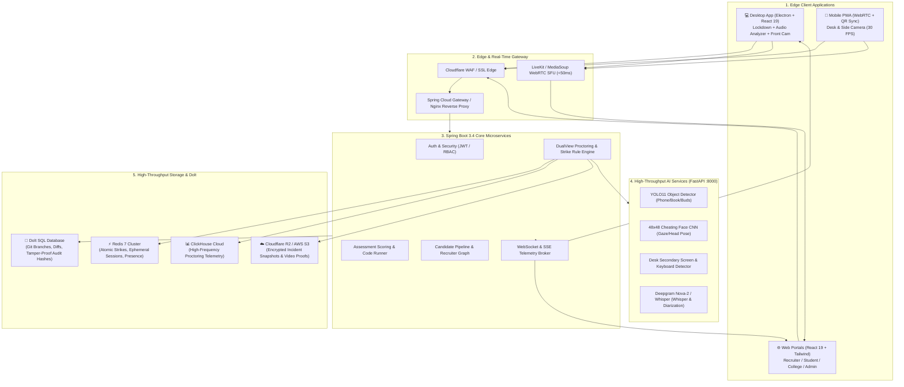
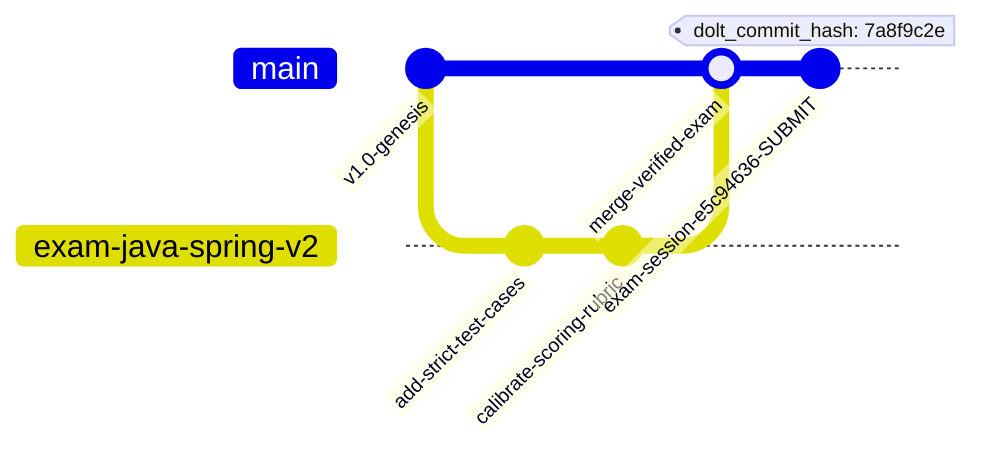

# 🏛️ BEYON COMPLETE SYSTEM SPECIFICATION & ARCHITECTURE BLUEPRINT

> **End-to-End Enterprise Architecture: Dolt (Git-for-Data), React 19 Frontend, Electron Lockdown Desktop, Mobile PWA Dual-View, Spring Boot 3.4 Microservices, FastAPI AI Inference, and Real-Time WebRTC SFU.**

---

## 📑 Table of Contents
1. [Full System Topology](#1-full-system-topology)
2. [Data Tier: Dolt (Version-Controlled SQL Database)](#2-data-tier-dolt-version-controlled-sql-database)
3. [Frontend Tier: React 19 Enterprise Ecosystem](#3-frontend-tier-react-19-enterprise-ecosystem)
4. [Desktop Lockdown Tier: Electron + Native Kernel Guard](#4-desktop-lockdown-tier-electron--native-kernel-guard)
5. [Mobile Dual-View Tier: PWA & WebRTC Streaming](#5-mobile-dual-view-tier-pwa--webrtc-streaming)
6. [Backend Tier: Spring Boot 3.4 Orchestration & Event Bus](#6-backend-tier-spring-boot-34-orchestration--event-bus)
7. [AI Inference Tier: FastAPI, YOLO11, Face CNN & Speech AI](#7-ai-inference-tier-fastapi-yolo11-face-cnn--speech-ai)
8. [Internal vs. External Connection Contracts & Protocols](#8-internal-vs-external-connection-contracts--protocols)

---

## 1. Full System Topology



---

## 2. Data Tier: Dolt (Version-Controlled SQL Database)

### Why Dolt (Git-for-Data)?
Dolt runs as a drop-in replacement for MySQL on port **3306** using the standard MySQL wire protocol, with Git-like version control (`branches`, `diffs`, `merges`, and `cryptographic commit hashes`).



### Dolt Schema Architecture
1. **Rubric & Question Versioning (`branching`)**:
   - Placement cells and companies can create branch `spring-backend-batch-2026` to edit questions, test cases, and passing criteria without affecting live exams.
   - Once approved, the branch is merged into `main` using `CALL DOLT_MERGE('feature-branch')`.
2. **Tamper-Proof Audit Logs**:
   - Every completed exam submission generates a Dolt commit with author metadata:
     ```sql
     CALL DOLT_COMMIT('-m', 'Candidate Gowtham (id=101) completed assessment e5c94636. Score=92.5%, Disqualified=0', '--author', 'BeyonEngine <engine@beyon.tech>');
     ```
   - If anyone tampers with a candidate's score in the database, `SELECT * FROM DOLT_DIFF('main~1', 'main', 'assessment_results')` immediately exposes the unauthorized edit.

---

## 3. Frontend Tier: React 19 Enterprise Ecosystem

### Key Portals
1. **Recruiter Talent & Assessment Portal** (`/company/*`):
   - **Candidate Pool**: Filter by verified score, verified skills, and academic CGPA.
   - **Live Proctoring Video Wall**: Real-time 4x4 or 8x8 video grid showing synchronized laptop & mobile camera streams via WebRTC.
   - **Interactive Audit Report**: Timeline scrubbing of all gaze shifts, audio anomalies, and phone detections with instant snapshot modal.
2. **Candidate Assessment Experience** (`/student/assessment/*`):
   - Monaco code editor with syntax highlighting, autocomplete, and live test case runner.
   - Non-intrusive dual-view connection status banner.
3. **Institution Placement Cell** (`/institution/*`):
   - Department-level performance dashboards, batch analytics, and exportable accredited integrity reports.

---

## 4. Desktop Lockdown Tier: Electron + Native Kernel Guard

### Anti-Cheating & Security Capabilities
- **Kiosk / Fullscreen Lock**: Prevents window resizing, minimize, or task switching (`Alt+Tab`, `Cmd+Tab`, `Windows Key`).
- **Process Guard & Sandbox**: Periodically scans active OS tasks and automatically kills unauthorized software:
  - Screen Sharing: `Discord.exe`, `TeamViewer.exe`, `AnyDesk.exe`, `Zoom.exe`, `Slack.exe`.
  - Developer Tools / Interceptors: `Fiddler.exe`, `Wireshark.exe`, `CheatEngine.exe`.
- **Display Protection**: Uses OS window capture prevention flags (`SetWindowDisplayAffinity(WDA_EXCLUDEFROMCAPTURE)` on Windows) to prevent OBS screen recording.
- **Audio RMS Monitor**: Local Web Audio API `AnalyserNode` monitoring room noise with 3-strike warning system.

---

## 5. Mobile Dual-View Tier: PWA & WebRTC Streaming

### How the Side Camera Works
1. Candidate launches desktop test $
ightarrow$ Desktop displays secure QR code containing:
   `https://beyon.tech/mobile-proctor?session=e5c94636&token=eyJhbGciOi...`
2. Candidate scans with smartphone $
ightarrow$ Opens lightweight mobile PWA.
3. Smartphone accesses rear camera (1080p / 720p at 30 FPS).
4. **Gyroscope / Accelerometer Verification**: Validates the phone is positioned on a desk stand at a $45^\circ$ lateral angle covering candidate hands, keyboard, and laptop screen.
5. Sends continuous WebRTC stream / 1.5s base64 telemetry frames to backend.

---

## 6. Backend Tier: Spring Boot 3.4 Orchestration & Event Bus

### Architecture & Service Design
- **API Gateway & Routing**: Handles JWT authentication, rate limiting, and RBAC (`STUDENT`, `COMPANY`, `INSTITUTION`, `ADMIN`).
- **Strike & Warning Engine (`RuleEngine`)**:
  - **Mobile Phone Detected**: 0 Warnings $
ightarrow$ Instant Disqualification.
  - **Second Person Present**: 1 Warning $
ightarrow$ Disqualifies on 2nd offense.
  - **Audio / Talking Detected**: 3 Warnings $
ightarrow$ Disqualifies on 4th offense.
  - **Left Camera View**: 2 Warnings $
ightarrow$ Disqualifies on 3rd offense.
- **Spring Event Bus**: Decoupled domain events:
  - `AssessmentSubmittedEvent` $
ightarrow$ triggers `TalentPipelineService`, `SkillEvidenceService`, `GamificationCoinService`, and `NotificationService` in parallel asynchronously.

---

## 7. AI Inference Tier: FastAPI, YOLO11, Face CNN & Speech AI

### Microservice Endpoints (`:8000`)
1. **`POST /analyze/laptop-frame`**:
   - **Input**: Base64 JPEG frame from laptop webcam.
   - **YOLO11**: Detects mobile phones (`class 67`), headphones/earbuds (`class 73`), books (`class 73`).
   - **Cheating CNN (48x48)**: Detects head rotation, eyes off screen, and second face in background.
2. **`POST /analyze/mobile-frame`**:
   - **Input**: Base64 JPEG frame from mobile lateral desk camera.
   - **YOLO11 & CV Detector**: Analyzes desk area for handheld smartphones, secondary monitor aspect ratios, and smartwatches.
3. **`POST /analyze/audio-chunk`** (Cloud Integration):
   - **Deepgram Nova-2**: Real-time speech-to-text with multi-speaker diarization to detect whispering accomplices.

---

## 8. Internal vs. External Connection Contracts & Protocols

| Connection Path | Type | Protocol | Port / Transport | Payload / Data |
| :--- | :--- | :--- | :--- | :--- |
| **Desktop $
ightarrow$ Backend** | Internal | HTTPS / JSON REST | `:8085` / TLS | Auth, Question Fetch, Answers, Offline Synced DB |
| **Desktop $
ightarrow$ Backend** | Internal | WSS (WebSocket) | `:8085` / WSS | Warning banners, Heartbeats, Remote Disqualify Kill |
| **Mobile $
ightarrow$ Backend** | Internal | HTTPS / Base64 | `:8085` / TLS | QR Handshake, Lateral Frame Telemetry |
| **Backend $
ightarrow$ FastAPI AI** | Internal | HTTP/2 / REST / gRPC | `:8000` / TCP | Raw Frame bytes, Bounding Box JSON responses |
| **Backend $
ightarrow$ Redis 7** | Internal | RESP Protocol | `:6379` / TCP | Strike counters (`INCRBY`), Session presence TTL |
| **Backend $
ightarrow$ Dolt DB** | Internal | MySQL Wire Protocol | `:3306` / TCP | Standard SQL Queries, Dolt Branch/Commit stored procs |
| **Desktop/Mobile $
ightarrow$ SFU** | External | WebRTC (SRTP/DTLS) | `:7880` / UDP | 30 FPS Live Video Tracks (VP9/H.264) |
| **Recruiter $
ightarrow$ SFU** | External | WebRTC (SRTP/DTLS) | `:7880` / UDP | Multi-stream Live Video Grid Wall |
| **Backend $
ightarrow$ Cloudflare R2** | External | S3 REST API | HTTPS `:443` | Encrypted WebP violation proof images |
| **Backend $
ightarrow$ Deepgram API** | External | WebSocket / REST | HTTPS `:443` | Audio chunks $
ightarrow$ Transcribed speech text & speaker ID |

