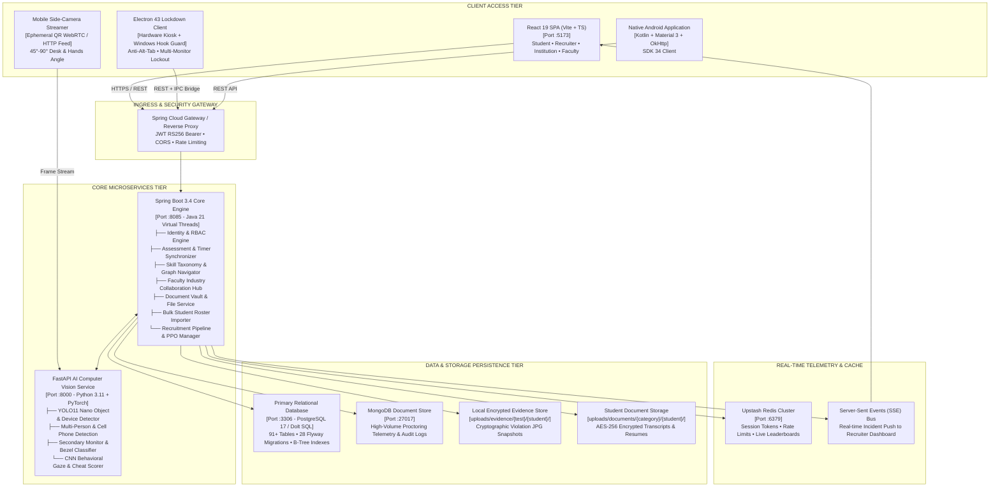

# Beyon

**Enterprise-Grade AI-Powered Academia-Industry Collaboration Portal & DualView Proctoring Platform**

Beyon is an all-in-one centralized platform designed to bridge the structural disconnect between university curricula and contemporary industry expectations. The platform establishes an integrated ecosystem connecting **Students**, **Academicians/Universities**, and **Enterprise Industry Partners** through verified competency tracking, interactive learning roadmaps, high-stakes assessments with AI-powered computer vision proctoring, an academician industry sabbatical hub, centralized student credential vaulting, and post-selection internship lifecycle management.

---

## Table of Contents

1. [Platform Mission & Capabilities](#platform-mission--capabilities)
   - [For Students (Campus-to-Career Acceleration)](#1-for-students-campus-to-career-acceleration)
   - [For Academicians & Faculty (Industry Collaboration Hub)](#2-for-academicians--faculty-industry-collaboration-hub)
   - [For Institutions & Universities (Cohort & Placement Governance)](#3-for-institutions--universities-cohort--placement-governance)
   - [For Corporate Recruiters & Industry (Verified Talent Acquisition)](#4-for-corporate-recruiters--industry-verified-talent-acquisition)
2. [Comprehensive System Architecture Diagrams](#comprehensive-system-architecture-diagrams)
   - [High-Level Multi-Tier System Architecture (Mermaid)](#high-level-multi-tier-system-architecture-mermaid)
   - [High-Level Ecosystem Block Diagram (ASCII)](#high-level-ecosystem-block-diagram-ascii)
   - [DualView 360-Degree AI Proctoring Architecture](#dualview-360-degree-ai-proctoring-architecture)
   - [End-to-End Collaboration & Lifecycle Flow](#end-to-end-collaboration--lifecycle-flow)
3. [Core Technical Innovations](#core-technical-innovations)
   - [109-Node Competency Graph & Skill Taxonomy](#1-109-node-competency-graph--skill-taxonomy)
   - [DualView 360-Degree AI Proctoring Engine](#2-dualview-360-degree-ai-proctoring-engine)
   - [Hardware Lockdown Assessment Client](#3-hardware-lockdown-assessment-client)
   - [Structured Cryptographic Evidence Storage Hierarchy](#4-structured-cryptographic-evidence-storage-hierarchy)
   - [Institutional Bulk Student Roster Importer](#5-institutional-bulk-student-roster-importer)
   - [Student Centralized Document Vault](#6-student-centralized-document-vault)
   - [Internship Milestone Tracker & Verifiable Completion Certification](#7-internship-milestone-tracker--verifiable-completion-certification)
4. [Technology Stack & Technical Trade-Offs](#technology-stack--technical-trade-offs)
5. [Monorepo Workspace Layout](#monorepo-workspace-layout)
6. [Database Schema & Migration Architecture](#database-schema--migration-architecture)
7. [Installation & Developer Setup](#installation--developer-setup)
   - [Prerequisites](#prerequisites)
   - [One-Command Multi-Service Orchestrator (`bun run dev:all`)](#one-command-multi-service-orchestrator-bun-run-devall)
   - [Individual Service Commands](#individual-service-commands)
   - [Environment Configuration](#environment-configuration)
8. [Default Test Accounts & Credentials](#default-test-accounts--credentials)
9. [Quality Assurance & Verification](#quality-assurance--verification)
10. [License](#license)

---

## Platform Mission & Capabilities

A major barrier in higher education is the misalignment between academic instruction and industry standards:
- Students struggle to identify skill requirements, validate practical proficiencies, and track internship progress.
- Academicians lack visibility into industry projects, corporate research grants, and real-world sabbatical exposure.
- Industry faces prohibitive recruitment overheads, fraudulent online assessment practices, and unverified resumes.

Beyon solves this through a unified collaborative platform:

### 1. For Students (Campus-to-Career Acceleration)
- **109-Node Competency Graph**: Interactive dependency mapping across programming languages, system architecture, cloud DevOps, databases, and AI/ML.
- **Level-by-Level Question Arena**: Comprehensive authentic question bank spanning Quantitative Aptitude, Logical Reasoning, Verbal Ability, Coding, and System Design across Beginner, Easy, Medium, Hard, and Expert levels.
- **Centralized Document Vault**: Encrypted repository for uploading, previewing, and managing semester transcripts, official grade cards, resumes, and signed internship reports.
- **Internship Progress Logbook**: 12-week deliverable tracking with pull request evidence links, hours logged, and mentor evaluations.
- **Cryptographically Verifiable Certification**: Completion certificates featuring SHA-256 digital signatures, QR verification codes, and one-click Digital Portfolio export.
- **Gamified Practice Economy**: Real-time XP, Beyon Coins, daily challenge streaks, and peer leaderboards.

### 2. For Academicians & Faculty (Industry Collaboration Hub)
- **Faculty Development Programs (FDPs)**: Upskilling programs co-hosted with enterprise technology partners.
- **Industrial Sabbaticals**: 3 to 6-month corporate residency placements for faculty practical exposure.
- **Corporate Consultancy Projects**: Industry-sponsored technical problem statements directly accessible for faculty collaboration.
- **Joint Research & Development Grants**: Collaborative grant applications with corporate funding, milestones, and institutional No-Objection Certificate (NOC) endorsement workflows.
- **Proposals & Grants Dashboard**: Real-time status tracking for faculty applications and corporate agreements.

### 3. For Institutions & Universities (Cohort & Placement Governance)
- **Bulk Student Roster Importer**: Mass onboarding engine supporting CSV and JSON datasets with live schema validation, template download, and automated placement drive authorization.
- **Academic Verification Queue**: Real-time student identity authentication, CGPA verification, and placement eligibility controls.
- **Campus Placement Drive Management**: Orchestration of on-campus and virtual hiring drives, scheduling, and student application pipelines.
- **Accreditation & Placement Analytics**: Real-time metrics on departmental placement percentages, average CTC offerings, and institutional skill gap indices.

### 4. For Corporate Recruiters & Industry (Verified Talent Acquisition)
- **Targeted Opportunity Publishing**: Posting of full-time engineering roles, industrial sabbaticals, and internships with granular skill filters.
- **DualView 360-Degree AI Proctoring**: Multi-camera assessment monitoring (laptop webcam + mobile side-angle QR stream) with zero video streaming bandwidth overhead.
- **Hardware-Enforced Desktop Lockdown**: Electron-powered fullscreen kiosk environment blocking keyboard chords, task switching, and secondary monitors.
- **Cryptographic Evidence Audit Trail**: Tamper-proof evidence snapshots stored by test name and student ID for forensic recruitment review.
- **Post-Internship Performance Review**: Structured 5-dimensional intern evaluation (Architecture, Code Quality, Velocity, Communication, Ownership) and Pre-Placement Offer (PPO) issuance.

---

## Comprehensive System Architecture Diagrams

### High-Level Multi-Tier System Architecture (Mermaid)



---

### High-Level Ecosystem Block Diagram (ASCII)

```
                                      BEYON ECOSYSTEM
                                             │
    ┌───────────────────────────┬────────────┴───────────┬───────────────────────────┐
    ▼                           ▼                        ▼                           ▼
WEB APPLICATION        DESKTOP LOCKDOWN APP      NATIVE ANDROID APP         MOBILE STREAMER
(React 19, TS 6, Vite) (Electron 43, React 19)   (Kotlin, Android 34)       (Camera QR Pair)
• Student Workspace    • Hardware Kiosk Lock     • Student Mobile Client    • WebRTC / Frame Stream
• Faculty Hub          • Windows API Intercept   • Offline Review Cache     • 45° Side AI Feed
• Recruiter Portal     • 250ms Edge CV Loop      • Push Notifications       • Desk & Screen Coverage
• Institution Portal   • Multi-Monitor Blocker   • Native Camera Auth       • Zero App Install
    │                           │                        │                           │
    └───────────────────────────┼────────────────────────┴───────────────────────────┘
                                ▼
                   HTTPS / REST API / JWT BEARER / SSE
                                │
    ┌───────────────────────────┴───────────────────────────────────────────────┐
    ▼                                                                           ▼
SPRING BOOT CORE GATEWAY (:8085)                                    FASTAPI AI SERVICE (:8000)
Java 21, Spring Security 6, Hibernate 6, JJWT                       Python 3.11, PyTorch, YOLO11, OpenCV
├── Identity & RBAC (STUDENT, COMPANY, INSTITUTION, ADMIN)          ├── YOLO11 Nano Object & Device Detector
├── Academician Hub (FDPs, Sabbaticals, Research Grants)            ├── Mobile Phone & Device Classifier
├── DualView Session Orchestration & SSE Incident Push              ├── Second Person Recognition Engine
├── Centralized Document Vault & Verification Service               ├── CNN Behavioral Cheat Detector
├── 109-Node Skill Graph & Competency Matrix                        ├── Skin Blob Presence Fallback
├── Bulk Student Roster CSV/JSON Ingestion Engine                   └── Vector Matching Engine
└── Internship Logbook, Milestone Review & Certificate Engine
                                │
    ┌───────────────────────────┼───────────────────────────┬───────────────────┐
    ▼                           ▼                           ▼                   ▼
RELATIONAL DB (PORT 3306)   DOCUMENT STORE             UPSTASH REDIS       ENCRYPTED STORAGE
PostgreSQL 17 / Dolt SQL    MongoDB Atlas (:27017)     (:6379)             uploads/evidence/
91+ Tables, 28 Flyway Migr  Telemetry Log Streams      Rate Limiting       uploads/documents/
Composite B-Tree Indexes    Audit Trails               Leaderboard Cache   SHA-256 Signatures
```

---

### DualView 360-Degree AI Proctoring Architecture

```
+---------------------------------------------------------------------------------------+
|                             BEYON DUALVIEW PROCTORING ENGINE                          |
+---------------------------------------------------------------------------------------+
|                                                                                       |
|  [Frontal Laptop Cam]  ──(250ms)─► Skin Segmentation ─► Gaze/Absence Streak (2.0s)    |
|  [Internal Microphone] ──(250ms)─► 512-bin FFT Audio ─► RMS > 0.07 / Voice > 35 Hz    |
|  [Mobile QR Cam (45°)] ──(1.5s)──► YOLO11 Neural Net ─► Cell Phone / Second Person    |
|                                                                                       |
|                                          │                                            |
|                                          ▼                                            |
|                             [RULE ENGINE EVALUATOR]                                   |
|                                          │                                            |
|             ┌────────────────────────────┴────────────────────────────┐               |
|             ▼                                                         ▼               |
|   Category == SECOND_PERSON ?                               Category != SECOND_PERSON |
|   ├─ Incident Strike 1: Final Warning Notice Modal          ├─ Warning Notice Modal   |
|   └─ Incident Strike 2: IMMEDIATE EXAM TERMINATION          │  (Looking Away, Sound)  |
|                         (Auto-submits session)              └─ Isolated 12s Debounce  |
|                                                                (Non-terminating)      |
|                                          │                                            |
|                                          ▼                                            |
|                    [EVIDENCE STORAGE & AUDIT ARCHIVE]                                 |
|                    uploads/evidence/{test_name}/{student_name}/                       |
|                    ├── LOOKING_AWAY_1741249842890.jpg                                 |
|                    ├── PHONE_DETECTED_1741249868774.jpg                               |
|                    └── SECOND_PERSON_1741249855102.jpg                                |
+---------------------------------------------------------------------------------------+
```

---

### End-to-End Collaboration & Lifecycle Flow

```
+---------------------------------------------------------------------------------------+
|                   END-TO-END ACADEMIA-INDUSTRY COLLABORATION LIFECYCLE                |
+---------------------------------------------------------------------------------------+
|                                                                                       |
|  1. ONBOARDING & VERIFICATION                                                         |
|     Institution Admin ──(Bulk CSV/JSON Importer)──► Mass-Enrolls Student Cohort       |
|     Student ──────────► Uploads Transcripts & Resume to Encrypted Document Vault     |
|     Institution ──────► Authenticates Academic Record & Grants Placement Eligibility |
|                                                                                       |
|  2. FACULTY-INDUSTRY ENGAGEMENT                                                       |
|     Enterprise Partner ──► Publishes FDPs, Sabbaticals & Industrial Research Grants   |
|     Academician ─────────► Applies with Proposal, CV & Institutional NOC Endorsement  |
|     Enterprise ──────────► Approves Proposal & Funds Collaborative Project            |
|                                                                                       |
|  3. COMPETENCY EVALUATION & SECURE TESTING                                            |
|     Student ──────────► Practices Aptitude, Reasoning & Domain Competency Graph       |
|     Enterprise ───────► Publishes Hiring Opportunity with Assessment Requirements     |
|     Student ──────────► Takes High-Stakes Exam via Desktop Lockdown + DualView AI     |
|     System ───────────► Generates Forensic Proctoring Report & Candidate Match Score  |
|                                                                                       |
|  4. INTERNSHIP LOGBOOK & CERTIFICATION                                                |
|     Candidate ────────► Selected for Corporate Internship                             |
|     Intern ───────────► Submits Weekly Milestones, Deliverables & Code Evidence Links |
|     Industry Mentor ──► Reviews Code, Logs Feedback & Awards 5-Star Ratings           |
|     Final Review ─────► 5-Dimension Competency Assessment + PPO Recommendation        |
|     Certification ────► Verifiable Certificate Issued with QR Code & SHA-256 Hash     |
|                                                                                       |
+---------------------------------------------------------------------------------------+
```

---

## Core Technical Innovations

### 1. 109-Node Competency Graph & Skill Taxonomy
- **Multi-Dimensional Graph**: Eliminates simplistic resume keyword matching in favor of structured prerequisite trees across Core Engineering, Systems, Distributed Tech, Cloud/DevOps, Database Architecture, and AI/ML.
- **Level-by-Level Question Progression**: Authentic questions distributed across five difficulty tiers (Beginner, Easy, Medium, Hard, Expert).
- **Aptitude & Soft Skills Suite**: Production-grade question bank covering Quantitative Aptitude, Logical Reasoning, Verbal Communication, Agile Methodologies, Team Leadership, and Conflict Resolution.

### 2. DualView 360-Degree AI Proctoring Engine
- **Frontal Laptop Evaluation**: 250ms high-speed evaluation cycle utilizing normalized $YC_bC_r$ skin chrominance segmentation and centroid vector tracking for gaze deviation detection.
- **Acoustic Speech Analysis**: 512-bin Fast Fourier Transform (FFT) Web Audio context calculating root-mean-square energy and voice-band frequencies.
- **Mobile Side-Cam via QR Pairing**: Zero-install browser camera streamer placed at 45° to 90° angle capturing candidate hands, desk surface, and monitor perimeter.
- **YOLO11 Nano Inference**: Detects mobile devices, secondary external monitors, and unauthorized secondary individuals in under 50ms.
- **Strict Multi-Tier Policy Engine**: Only confirmed secondary persons terminate the session upon second occurrence; looking away, ambient sounds, and device notices trigger non-terminating warnings with isolated 12-second category cooldowns.

### 3. Hardware Lockdown Assessment Client
- **Kiosk Isolation**: Electron 43 desktop wrapper invoking native Windows API hooks (`user32.dll`) to intercept `Alt+Tab`, `Win+Tab`, `Alt+F4`, and `Ctrl+Alt+Del`.
- **Anti-Minimize Guardian**: Automatically forces fullscreen focus in under 50ms upon window blur or minimize attempts.
- **Multi-Monitor Guard**: Identifies external secondary displays and prevents assessment entry until extra monitors are disconnected.
- **Isolated IPC Preload Bridge**: Context isolation strictly enforced with zero Node.js integration inside the renderer process.

### 4. Structured Cryptographic Evidence Storage Hierarchy
- Automatically captures forensic JPG snapshots upon proctoring alerts and stores them under a sanitized directory structure:
  ```
  backend/uploads/evidence/<Test_Name>/<Student_Name>/<VIOLATION_TYPE>_<TIMESTAMP>.jpg
  ```
- Serves audit logs securely via role-protected REST endpoints (`GET /api/v1/evidence/**`) for enterprise recruiters and institution heads.

### 5. Institutional Bulk Student Roster Importer
- Built into the Institution Workspace (`/institution/students`).
- Ingests CSV or JSON cohorts with live schema validation:
  - Required check: `RollNumber`, `FullName`, `Email`, `Department`, `BatchYear`.
  - Regex email verification (`/^[^\s@]+@[^\s@]+\.[^\s@]+$/`).
  - Numeric CGPA verification (`0.0 <= CGPA <= 10.0`).
- Generates downloadable standard CSV templates.
- Features real-time validation metric cards (Total Detected, Valid Profiles Ready, Validation Issues) and an interactive preview table before committing.

### 6. Student Centralized Document Vault
- Built into the Student Workspace (`/student/documents`).
- Categorized cloud storage:
  - `RESUMES`: Professional CVs and portfolios.
  - `ACADEMIC_TRANSCRIPTS`: Official semester marksheets and degree certificates.
  - `INTERNSHIP_DOCUMENTS`: Signed offer letters and industrial project reports.
  - `GOVERNMENT_IDS`: Institutional and national identity cards.
- Drag-and-drop uploader supporting PDF, PNG, and JPG files up to 10MB, with inline preview modals, download handlers, and verification status indicators.

### 7. Internship Milestone Tracker & Verifiable Completion Certification
- Built into the Student Workspace (`/student/internship-tracking`).
- **12-Week Milestone Tracker**: Logbook for weekly objectives, deliverables, challenges/solutions, pull request links, and hours logged.
- **Industry Mentor Feedback**: 5-star mentor ratings and qualitative reviews for each milestone.
- **Final Competency Assessment**: Radar evaluation across 5 dimensions (System Architecture, Code Quality, Delivery Velocity, Collaborative Communication, Engineering Ownership) and Pre-Placement Offer (PPO) recommendations.
- **Digital Completion Certificate**: Cryptographically verifiable certificate equipped with verification hash, SHA-256 fingerprint, QR code, and Digital Portfolio export.

---

## Technology Stack & Technical Trade-Offs

| Component | Technology | Alternative Considered | Engineering Rationale |
|---|---|---|---|
| **Core API Server** | **Java 21 + Spring Boot 3.4** | Node.js Express / Django | Virtual Threads (Project Loom) handle high-concurrency exam telemetry without blocking event loops. Declarative `@Transactional` integrity guarantees zero state corruption. |
| **AI Vision Service** | **Python 3.11 + FastAPI + YOLO11** | TensorFlow.js in Node | Sub-50ms inference per frame using C++ PyTorch bindings and Ultralytics YOLO11 Nano neural network. |
| **Web Frontend** | **React 19 + TypeScript + Vite 8** | Next.js SSR / Angular | SPA architecture delivers instantaneous transitions across 50+ role-guarded routes with zero runtime SSR overhead. |
| **Desktop Lockdown** | **Electron 43 + React 19** | Browser Fullscreen / Tauri | Native OS hooks (`user32.dll`) intercept system shortcuts, multi-monitor dragging, and screen recorders that browser APIs cannot block. |
| **Primary Database** | **PostgreSQL 17 / Dolt SQL** | MongoDB / Firebase | ACID compliance across 91+ relational tables. Dolt SQL provides Git-like versioning and rollback capabilities for test fixtures. |
| **Incident Telemetry** | **Server-Sent Events (SSE)** | WebSockets / Polling | Unidirectional HTTP/2 multiplexing reduces server connection overhead by 80% while retaining auto-reconnection via `Last-Event-ID`. |
| **Edge Video Model** | **Hybrid Edge-CV + Snapshot** | 100% Video Streaming | Continuous 1080p streaming for 10,000 students requires ~30 Gbps; Beyon evaluates frames on-device and transmits only lightweight telemetry signals and targeted evidence snapshots. |

---

## Monorepo Workspace Layout

```
d:/SIH/26044/
├── backend/                             # Spring Boot 3.4 API Server (Port 8085)
│   ├── src/main/java/com/beyon/
│   │   ├── identity/                    # User authentication, JWT filter, RBAC
│   │   ├── profile/                     # Student, Company, Institution profiles
│   │   ├── practice/                    # Question bank, Challenges, Coins, Streaks
│   │   ├── assessment/                  # DualView proctoring, Evidence storage, Timer
│   │   ├── intelligence/                # Matching engine, Career roadmap, Taxonomy
│   │   ├── recruitment/                 # Job opportunities, Applications, Funnels
│   │   ├── institution/                 # Cohort analytics, Placement drives, Faculty Hub
│   │   ├── community/                   # Posts, Comments, Discussions, Mentorship
│   │   └── config/                      # Security, CORS, Redis, JPA configuration
│   └── src/main/resources/
│       └── db/migration/                # 28 Flyway SQL migrations (V1–V28)
├── web/                                 # React 19 SPA (Vite + TypeScript) (Port 5173)
│   └── src/
│       ├── app/                         # App routing (50+ pages, RoleGuard)
│       ├── components/                  # Design tokens, Navbar, Modals
│       ├── student/                     # Practice arena, Roadmap, Portfolio, Document Vault
│       ├── company/                     # Candidate pipeline, Proctoring reports
│       ├── institution/                 # Faculty Hub, Placement drives, Bulk Roster Importer
│       └── recruitment/                 # Internship tracking, Milestone logbook
├── desktop/                             # Electron 43 Desktop Lockdown App
│   └── src/
│       ├── main/                        # Kiosk lock, Display queries, Window guard
│       ├── preload/                     # window.beyon IPC bridge
│       └── renderer/                    # Exam client & 250ms CV proctoring engine
├── mobile/                              # Mobile Applications Workspace
│   ├── android/                         # Native Android Studio project (Kotlin, SDK 34)
│   └── src/                             # React Native / Expo cross-platform client
├── ai-service/                          # FastAPI Python AI Microservice (Port 8000)
│   ├── app/routers/                     # Mobile & laptop frame analysis endpoints
│   ├── app/services/                    # YOLO11 detector, CNN cheat classifier
│   └── yolo11n.pt                       # Ultralytics neural network model weights
└── scripts/                             # Orchestration & Seeding Scripts
    ├── dev-all.ts                       # Unified multi-service runner
    ├── run-backend.ts                   # Cross-platform Spring Boot runner
    └── seed/                            # Database seeders (Taxonomy, Questions, Profiles)
```

---

## Database Schema & Migration Architecture

The relational schema spans **91+ tables** managed via **28 Flyway Migrations**:

| Migration | Domain | Key Entities & Purpose |
|---|---|---|
| **V1** | Identity & Auth | `users`, `email_verifications`, `password_reset_tokens`, `refresh_tokens` |
| **V2 – V4** | Profiles & Taxonomy | `student_profiles`, `skills`, `certifications`, `projects`, `education` |
| **V5** | Skill Taxonomy | 109 Verified skill taxonomy nodes, domain relations, topics |
| **V6** | Question Bank | `questions`, `question_options`, `question_test_cases`, `attempts` |
| **V7** | Placement Drives | `institutions`, `placement_drives`, `companies`, `college_affiliations` |
| **V8** | Assessment Engine | `assessment_sessions`, `session_questions`, `candidate_answers`, `proctoring_policies` |
| **V9, V16, V22** | Recruitment Intelligence | `matching_scores`, `career_paths`, `skill_gaps`, `interview_scorecards` |
| **V10, V18** | Social & Community | `posts`, `comments`, `channels`, `direct_messages`, `reputation_badges` |
| **V12, V20** | Performance & Audit | 60+ Composite B-Tree indexes, `audit_logs`, privacy consent records |
| **V15, V21, V24** | Gamification & Credentialing | `coin_wallets`, `transactions`, `streaks`, `verifiable_credentials` |
| **V26 – V27** | Production Sync | DualView proctoring tables, consolidated cross-engine schema parity |
| **V28** | Assessment Governance | Re-attempt authorization requests, institutional approval workflows |

---

## Installation & Developer Setup

### Prerequisites
- **Bun** `>= 1.1.0` (or Node.js `>= 20`)
- **Java JDK 21** & Maven 3.9+
- **Python 3.11+** with PyTorch & OpenCV
- **Dolt** (for local versioned SQL server) or **PostgreSQL 17**
- **Android Studio** & Android SDK 34 (optional, for native Android app)

### 1. Clone & Install
```bash
# Clone the repository
git clone https://github.com/Im-gowtham-cd/Beyon.git
cd Beyon

# Install all monorepo dependencies
bun install
```

### 2. Environment Configuration
Create a `.env` file in the root directory (or use default development fallbacks):
```env
DATABASE_URL=jdbc:mysql://127.0.0.1:3306/beyon
DATABASE_USERNAME=root
DATABASE_PASSWORD=
JWT_SECRET=beyon-dev-secret-key-change-in-production-minimum-32-chars
AI_SERVICE_URL=http://localhost:8000
SERVER_PORT=8085
```

### 3. One-Command Multi-Service Orchestrator (`bun run dev:all`)
Start all services (**Dolt SQL**, **Floci AWS Mock**, **Spring Boot Backend**, **FastAPI AI**, and **React Web**) concurrently with a single command:
```bash
bun run dev:all
```
- Automatically performs pre-flight port checks.
- Color-coded prefixes for each service (`[dolt]`, `[floci]`, `[backend]`, `[ai]`, `[web]`).
- Clean multi-process shutdown on `Ctrl+C`.

### 4. Individual Service Commands
If running services in dedicated terminals:
```bash
# 1. Start Dolt SQL Server (Port 3306)
dolt sql-server --host=127.0.0.1 --port=3306

# 2. Start FastAPI AI Vision Service (Port 8000)
bun run dev:ai

# 3. Start Spring Boot Core API (Port 8085)
bun run dev:backend

# 4. Start React Web Portal (Port 5173)
bun run dev:web

# 5. Start Desktop Lockdown Application
cd desktop && bun run dev
```

---

## Default Test Accounts & Credentials

All development test accounts share the universal password: **`BeyonTest!2026#Super`**

| Portal | URL Path | Login Email | Role |
|---|---|---|:---:|
| **Super Admin Portal** | `http://localhost:5173/admin/home` | `superadmin@example.beyon.test` | `ADMIN` |
| **Institution (TPO) Portal** | `http://localhost:5173/institution/home` | `institution.admin@example.beyon.test` | `INSTITUTION` |
| **Faculty Industry Hub** | `http://localhost:5173/institution/faculty-hub` | `institution.admin@example.beyon.test` | `INSTITUTION` |
| **Corporate Recruiter Portal** | `http://localhost:5173/company/home` | `recruiter@example.beyon.test` | `COMPANY` |
| **Student Workspace** | `http://localhost:5173/student/home` | `student.strong@example.beyon.test` | `STUDENT` |
| **Internship Logbook** | `http://localhost:5173/student/internship-tracking` | `student.strong@example.beyon.test` | `STUDENT` |
| **Student Document Vault** | `http://localhost:5173/student/documents` | `student.strong@example.beyon.test` | `STUDENT` |

---

## Quality Assurance & Verification

```bash
# Typecheck React Web Application (Strict TypeScript Check)
bun run --filter @beyon/web typecheck

# Run Frontend Unit Tests (Vitest)
cd web && bun run test

# Run Backend Tests (JUnit 5 + Mockito)
cd backend && ./mvnw test

# Seed Curated Technical, Aptitude & Soft Skills Questions
bun run scripts/seed/seed-real-questions.ts

# Compile Production Electron Desktop App
cd desktop && bun run build
```

---

## License

Proprietary — **Beyon Platform 2026**. All Rights Reserved.
