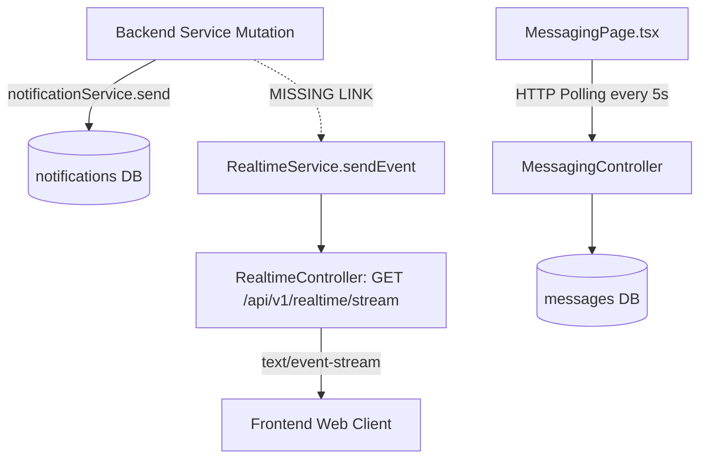

# Beyon — Real-Time & Notification Audit

**Document Version:** 1.0.0  
**Audit Date:** September 3, 2026  
**Auditor:** Distributed Real-Time Systems & Backend Engineer  
**Scope:** Real-Time Push Channels, Server-Sent Events (SSE), WebSockets, and Multi-Role Notification Pipelines.

---

## 1. Real-Time Architecture Overview

Beyon implements a lightweight **Server-Sent Events (SSE)** architecture in the Spring Boot backend alongside client-side HTTP polling for chat messaging.



---

## 2. Identified Vulnerabilities & Defects

### A. Critical SSE Memory Leak in `RealtimeController`
In [`RealtimeController.java:26-45`](file:///d:/SIH/26044/backend/src/main/java/com/beyon/platform/controller/RealtimeController.java#L26-L45):
```java
@GetMapping(value = "/stream", produces = MediaType.TEXT_EVENT_STREAM_VALUE)
public SseEmitter stream(Authentication auth) {
    UUID userId = UUID.fromString(auth.getName());
    SseEmitter emitter = new SseEmitter(0L);

    realtimeService.subscribe(userId, event -> {
        try {
            emitter.send(SseEmitter.event().data(event, MediaType.APPLICATION_JSON));
        } catch (Exception e) {
            emitter.complete();
            realtimeService.unsubscribe(userId, event1 -> {}); // BUG: new lambda reference
        }
    });

    emitter.onCompletion(() -> realtimeService.unsubscribe(userId, event -> {})); // BUG
    emitter.onTimeout(() -> realtimeService.unsubscribe(userId, event -> {}));    // BUG
    emitter.onError(e -> realtimeService.unsubscribe(userId, event -> {}));       // BUG
    return emitter;
}
```

#### Defect Analysis:
* `RealtimeService.unsubscribe(userId, callback)` executes `list.remove(callback)`.
* In Java, passing a new lambda instance `event -> {}` creates a distinct object reference.
* When a browser tab closes, refreshes, or times out, the `unsubscribe()` call attempts to remove an object that was never in the list.
* The original listener closure holding the `SseEmitter` and its underlying TCP socket reference **is never removed from memory**.
* Over time, the server exhausts thread pool resources and encounters `OutOfMemoryError`.

#### Fix:
Store the subscriber reference in a local variable:
```java
Consumer<String> callback = event -> {
    try {
        emitter.send(SseEmitter.event().data(event, MediaType.APPLICATION_JSON));
    } catch (Exception e) {
        emitter.complete();
    }
};
realtimeService.subscribe(userId, callback);
emitter.onCompletion(() -> realtimeService.unsubscribe(userId, callback));
emitter.onTimeout(() -> realtimeService.unsubscribe(userId, callback));
emitter.onError(e -> realtimeService.unsubscribe(userId, callback));
```

---

### B. The Unlinked Notification Dispatch Problem
* Currently, `NotificationService.send()` only executes `notificationRepository.save(notification)`.
* It **never calls** `RealtimeService.sendEvent(userId, event)`.
* As a result, users only see notifications when they manually navigate to `/notifications` or hard-refresh their browser.
* Real-time notifications never pop up while navigating the portal.

---

### C. Frontend Chat Messaging Architecture
* [`src/community/pages/MessagingPage.tsx:121-124`](file:///d:/SIH/26044/web/src/community/pages/MessagingPage.tsx#L121-L124) utilizes a 5-second `setInterval` HTTP polling loop to fetch active conversations and messages.
* While simple, this creates high database query load when multiple active users chat.
* Wiring the chat into the SSE stream or a WebSocket channel will eliminate polling overhead and provide sub-second delivery.

---

## 3. Real-Time Event Dictionary

The following events will be transmitted over the unified SSE stream:

| Event Name | Category | Payload Structure | Triggering Action |
|---|---|---|---|
| `ASSESSMENT_EVALUATED` | Assessment | `{ sessionId, score, accuracy, integrityStatus }` | Assessment finalization |
| `APPLICATION_STATUS` | Recruitment | `{ applicationId, companyName, role, status }` | Recruiter advances candidate stage |
| `OFFER_ISSUED` | Placement | `{ offerId, companyName, role, packageAmount }` | Company generates placement offer |
| `COIN_UPDATE` | Gamification | `{ amount, balance, reason }` | Coins earned or spent |
| `STREAK_MILESTONE` | Gamification | `{ currentStreak, badgeKey, badgeName }` | Daily streak increment |
| `MESSAGE_RECEIVED` | Community | `{ conversationId, senderId, content, sentAt }` | User sends chat message |
| `VERIFICATION_STATUS` | Identity | `{ role, status, message }` | TPO verifies student account |
