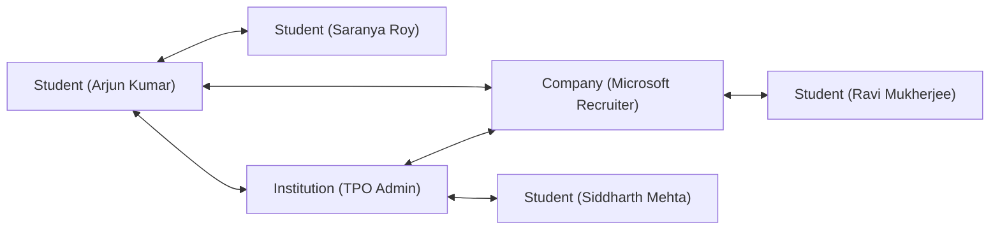

# 🔐 Beyon Platform — Test Accounts & Credentials Directory

> [!CAUTION]
> **DEVELOPMENT & STAGING ONLY**  
> These accounts and credentials are for local development, automated integration testing, and staging demonstration purposes only. Never use these credentials in production environments.

---

## ⚡ Quick Access & Universal Password

All seeded test accounts across all roles share a **Universal Development Password**:

$$\mathbf{BeyonTest!2026\#Super}$$

| Portal | URL Path | Primary Test Account | Role |
|---|---|---|---|
| **Super Admin Portal** | `http://localhost:5173/admin/home` | `superadmin@example.beyon.test` | `ADMIN` |
| **Institution (TPO) Portal** | `http://localhost:5173/institution/home` | `institution.admin@example.beyon.test` | `INSTITUTION` |
| **Corporate Recruiter Portal** | `http://localhost:5173/company/home` | `recruiter@example.beyon.test` | `COMPANY` |
| **Student Workspace** | `http://localhost:5173/student/home` | `student.strong@example.beyon.test` | `STUDENT` |
| **Direct Messaging Hub** | `http://localhost:5173/institution/messages` | `institution.admin@example.beyon.test` | Cross-Role |

---

## 1. 🛡️ Platform & Governance Administrators

Full access to the **Super Admin Governance Portal** (`/admin/home`), user management, audit trails, question bank moderation, economy controls, and institutional compliance.

| Role / Title | Email Address | Password | Permissions & Notes |
|---|---|---|---|
| **Super Admin** | `superadmin@example.beyon.test` | `BeyonTest!2026#Super` | Full root administrative access across all portals, database metrics, and economy controls |
| **Platform Admin** | `admin@example.beyon.test` | `BeyonTest!2026#Super` | Platform user operations, reports, question bank management |
| **Moderator** | `moderator@example.beyon.test` | `BeyonTest!2026#Super` | Community moderation, discussion thread flagging, feedback review |

---

## 2. 🎓 Student Personas & Candidates

Pre-configured student cohorts reflecting diverse academic performance levels, skill distributions, wallet balances, and assessment states.

| Persona | Name | Email Address | Password | CGPA | Coins | Persona Profile & Use Case |
|---|---|---|---|:---:|:---:|---|
| **Persona A: High Performer** | Arjun Kumar | `student.strong@example.beyon.test` | `BeyonTest!2026#Super` | **9.10** | 185 | Top Tier-1 candidate, 98.4% assessment score, verified skills in Distributed Systems & Cloud |
| **Persona B: Placement Willing** | Priya Nair | `student.placement@example.beyon.test` | `BeyonTest!2026#Super` | **7.60** | 1,055 | Active campus drive applicant, completed proctored benchmarks, placement ready |
| **Persona C: Average / Low** | Ravi Shankar | `student.weak@example.beyon.test` | `BeyonTest!2026#Super` | **6.40** | 195 | Remediation candidate, targeted for practice arena & skill gap recommendations |
| **Persona D: Independent** | Vikram Reddy | `student.independent@example.beyon.test` | `BeyonTest!2026#Super` | **8.30** | 455 | Off-campus seeker, freelance portfolio, not registered for college placement drives |
| **Persona E: Incomplete** | Sneha Pillai | `student.incomplete@example.beyon.test` | `BeyonTest!2026#Super` | — | 295 | Unverified student profile for testing onboarding wizard and profile completion flows |
| **Standard Student** | Arjun Sharma | `student@beyon.test` | `BeyonTest!2026#Super` | 8.80 | 2,500 | Default quick-test student account with large coin reserve and full profile |

### Assessment & Exam State Candidates

| Candidate State | Email Address | Password | Assessment Lifecycle State |
|---|---|---|---|
| **Eligible & Ready** | `exam.candidate1@example.beyon.test` | `BeyonTest!2026#Super` | Ready to take proctored test (1,000 coins balance) |
| **Ineligible CGPA** | `exam.candidate2@example.beyon.test` | `BeyonTest!2026#Super` | Blocked from high-cutoff drives (CGPA below minimum) |
| **Insufficient Coins** | `exam.candidate3@example.beyon.test` | `BeyonTest!2026#Super` | Low coin balance for testing wallet recharge / earning prompts |
| **Test In Progress** | `exam.candidate4@example.beyon.test` | `BeyonTest!2026#Super` | Active live assessment session in progress |
| **Evaluation Complete**| `exam.candidate5@example.beyon.test` | `BeyonTest!2026#Super` | Completed test with proctored scorecards and skill breakdown |

---

## 3. 🏛️ Higher-Ed Institutions & Placement Cells (TPO)

Access to **Institutional Analytics, Placement Drives, Student Verification Roster, and Recruiter Outreach** (`/institution/home`).

| Institution Name | City | TPO Admin Email | Password | Placement Rate | Accreditation |
|---|---|---|---|:---:|:---:|
| **Primary TPO Admin** | Chennai | `institution.admin@example.beyon.test` | `BeyonTest!2026#Super` | 94.2% | NAAC A++ |
| **Placement Cell Officer** | Bangalore | `placement@example.beyon.test` | `BeyonTest!2026#Super` | 91.8% | NBA Accredited |
| **Beyon Institute of Technology (BIT)** | Chennai | `admin@bit001.beyon.test` | `BeyonTest!2026#Super` | **94.2%** | Autonomous / NIRF #24 |
| **Apex College of Engineering (ACE)** | Bangalore | `admin@ace001.beyon.test` | `BeyonTest!2026#Super` | **91.8%** | Autonomous / NIRF #38 |
| **National Inst. of Applied Sciences (NIAS)** | Hyderabad | `admin@nias001.beyon.test` | `BeyonTest!2026#Super` | **89.5%** | Institute of Tech |
| **Premier School of Computing (PSC)** | Pune | `admin@psc001.beyon.test` | `BeyonTest!2026#Super` | **87.4%** | NAAC A+ |
| **Vega University of Engineering (VUE)** | Coimbatore| `admin@vue001.beyon.test` | `BeyonTest!2026#Super` | **85.0%** | Deemed University |
| **Zenith College of Engineering (ZCE)** | Chennai | `admin@zce001.beyon.test` | `BeyonTest!2026#Super` | **78.3%** | Affiliated |
| **Academic Faculty Lead** | Chennai | `faculty@example.beyon.test` | `BeyonTest!2026#Super` | — | Faculty Coordinator |

---

## 4. 🏢 Corporate Enterprise Employers & Recruiters

Access to **AI Candidate Discovery, Job/Drive Creation, Assessment Benchmark Builder, and Candidate Pipelines** (`/company/home`).

| Company Name | Industry | Tier | Recruiter Email Address | Password |
|---|---|:---:|---|---|
| **Enterprise Administrator** | Technology | Tier-1 | `company.admin@example.beyon.test` | `BeyonTest!2026#Super` |
| **Microsoft IDC Recruiter** | Cloud & AI Systems | Tier-1 | `recruiter@example.beyon.test` | `BeyonTest!2026#Super` |
| **Google Cloud Enterprise** | Cloud Infrastructure | Tier-1 | `company@beyon.test` | `BeyonTest!2026#Super` |
| **Amazon Web Services (AWS)** | Cloud & Distributed Systems | Tier-1 | `admin@aws.beyon.test` | `BeyonTest!2026#Super` |
| **Razorpay Technologies** | FinTech & Payments | Tier-1 | `admin@razorpay.beyon.test` | `BeyonTest!2026#Super` |
| **Zoho Corporation** | SaaS Products | Tier-2 | `admin@zoho.beyon.test` | `BeyonTest!2026#Super` |
| **Swiggy Tech** | Consumer Internet | Tier-1 | `admin@swiggy.beyon.test` | `BeyonTest!2026#Super` |
| **Flipkart Engineering** | E-Commerce Platforms | Tier-1 | `admin@flipkart.beyon.test` | `BeyonTest!2026#Super` |
| **Industry Mentor Lead** | Advisory & Career Guidance | — | `mentor@example.beyon.test` | `BeyonTest!2026#Super` |

---

## 5. 💬 Cross-Role Communication & Messaging Test Matrix

The direct messaging system supports all 6 cross-role communication pathways. Use the following pre-seeded conversation pairs to test end-to-end chat interactions:

| Pathway | Account A (Login as) | Account B (Recipient) | Active Conversation Topic |
|---|---|---|---|
| **Student ↔ Student** | `student.strong@example.beyon.test` | Saranya Roy (`student2@beyon.test`) | Hackathon team formation & Docker repo commit |
| **Student ↔ Institution** | `student.strong@example.beyon.test` | `institution.admin@example.beyon.test` | Campus placement clearance & 9.42 CGPA verification |
| **Student ↔ Company** | `student.strong@example.beyon.test` | `recruiter@example.beyon.test` | Technical interview invitation after 98.4% OA score |
| **Institution ↔ Student** | `institution.admin@example.beyon.test` | Siddharth Mehta (`siddharthmehta1031@...`) | Resume & verified skill taxonomy update notification |
| **Institution ↔ Company** | `institution.admin@example.beyon.test` | `recruiter@example.beyon.test` | Microsoft IDC on-campus drive lab reservation (Lab 4 & 5) |
| **Company ↔ Student** | `recruiter@example.beyon.test` | Ravi Mukherjee (`student.placement@...`) | Coding evaluation pass confirmation & interview dispatch |

---

## 6. 🔒 Security & Database Best Practices

1. **BCrypt Salted Password Hashes**: All accounts use 10-round salted BCrypt hashes (`$2b$10$...`) stored in Dolt DB.
2. **Deterministic Foreign Keys**: All profiles, wallets, streaks, applications, and messages link directly to the root `users.id` UUID.
3. **Double-Entry Ledger Integrity**: Every wallet balance satisfies:
   $$\text{balance} = \sum \text{EARNED transactions} - \sum \text{SPENT transactions}$$
4. **Environment Isolation**: Seed scripts and test credentials automatically abort if `NODE_ENV=production` or `SPRING_PROFILES_ACTIVE=prod`.
