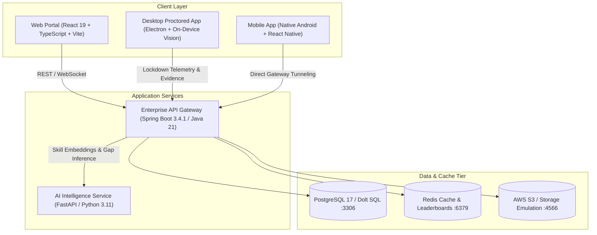
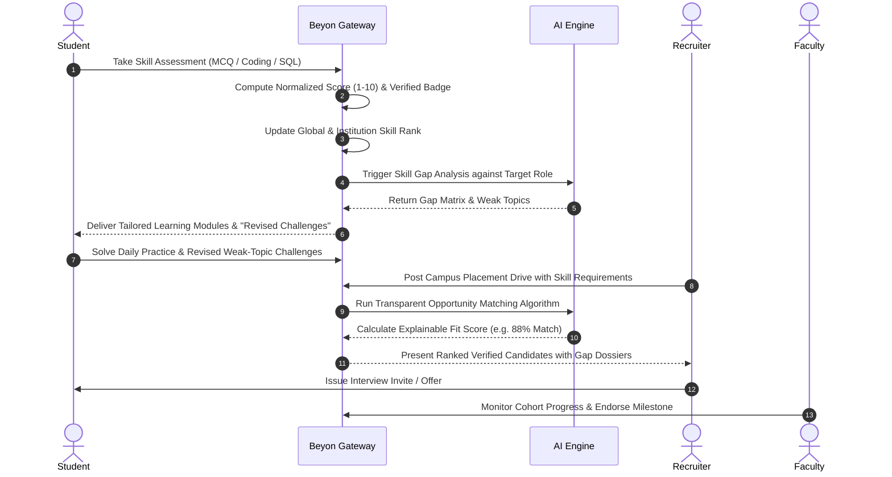

# Academia–Industry Collaboration Portal — System Architecture & Design Specification

## 1. Executive Summary & Vision

The **Academia–Industry Collaboration Portal (Beyon)** is an integrated, continuous **Skill-to-Career Ecosystem** designed to bridge the gap between higher education institutions, students, faculty mentors, and corporate recruiters. 

Instead of treating assessments, learning, practice, and campus placements as disjointed point solutions, Beyon unifies the entire lifecycle under a deterministic pipeline:

```
[ ASSESS ] ──▶ [ RANK ] ──▶ [ IDENTIFY GAP ] ──▶ [ LEARN ] ──▶ [ PRACTICE ]
    │                                                               │
    ▼                                                               ▼
[ PLACE ] ◀── [ INTERN ] ◀──── [ MATCH ] ◀──── [ IMPROVE ] ◀── [ CHALLENGE ]
```

---

## 2. Multi-Platform System Architecture

Beyon is organized as a unified monorepo supporting high-performance web, desktop lockdown, mobile access, an enterprise Spring Boot backend, and a dedicated AI Microservice:



---

## 3. Core Roles & Multi-Tier RBAC Hierarchy

| Role | Key Capabilities & Portals |
|---|---|
| **STUDENT** | Skill Assessment, Verified Skill Profile, Practice Arena, Daily/Weekly Challenges, Gap Remediation, Career Roadmaps, Drive Applications, Portfolio, Mentorship Booking. |
| **FACULTY** | Department Roster & Skill Gap Tracking, Mentorship Session Scheduling, Workshop/Webinar Creation, Collaborative Student-Industry Project Advising. |
| **INSTITUTION** (Admin, Principal, Placement Officer, HOD) | AICTE Onboarding, Student Cohort Import & Bulk Provisioning, Departmental Monitoring Dossier, Campus Placement Drive Management, Curriculum Alignment Analytics. |
| **INDUSTRY** (Recruiter, Technical Manager) | MCA/CIN Verification, Opportunity Creation (Internships, FTE, Hackathons), Custom Assessment Builder & Question Bank, Match Scoring, Pipeline ATS. |
| **SUPER_ADMIN** | Institutional & Enterprise Verification Approvals, Master Skill Taxonomy Graph, Economic Parameters (XP/Coin Rules), Moderation & Audit Logs. |

---

## 4. Continuous Skill-to-Career Workflow



---

## 5. Subsystem Architecture Specifications

### 5.1 Skill Assessment & Verification Engine
- **Taxonomy**: 109+ standardized industry skills across 12 domains (Web, AI/ML, Cloud, DevOps, Embedded, Core Engineering, etc.).
- **Scoring & Normalization**:
  $$\text{Normalized Level} = \left\lfloor \frac{\text{Score}_{\text{raw}}}{\text{Total Score}} \times 10 \right\rfloor \in [1, 10]$$
- **Verification States**: `DECLARED` (Self-reported) $\rightarrow$ `VERIFIED` (Assessment passed $\ge 70\%$) $\rightarrow$ `CERTIFIED` (Proctored / External credential).

### 5.2 Deterministic Skill Gap & Recommendation Algorithm
- Given a Target Role $R = \{(s_1, l_1^*), (s_2, l_2^*), \dots, (s_k, l_k^*)\}$ and Student Profile $S = \{(s_1, l_1), (s_2, l_2), \dots, (s_m, l_m)\}$:
  $$\text{Gap}(s_i) = \max(0, l_i^* - l_i)$$
- Automatically routes the student into **Adaptive Learning Paths**, recommended open-source projects, and targeted **Revised Challenges**.

### 5.3 Dual-View AI Proctoring & Integrity Engine
- **Primary View**: Client-side face detection, multi-face tracking, gaze anomaly calculation, acoustic FFT spectral analysis.
- **Secondary View**: Mobile companion device paired via QR code streaming room telemetry.
- **Evidence Pipeline**: Auto-flags incidents (`TAB_SWITCH`, `SPEECH_DETECTED`, `MULTIPLE_FACES`, `NO_FACE`) and computes an aggregate **Proctoring Risk Index** ($0 - 100$).

### 5.4 Transparent Opportunity Matching Engine
- **Match Score Formula**:
  $$\text{MatchScore} = w_{\text{skill}} \cdot S_{\text{match}} + w_{\text{exp}} \cdot E_{\text{match}} + w_{\text{cgpa}} \cdot C_{\text{match}} + w_{\text{proj}} \cdot P_{\text{match}}$$
- Provides full transparency to both student and recruiter:
  - Matched Required Skills (Green)
  - Missing Gaps with Estimated Time to Bridge (Amber/Red)
  - Verification Authenticity Proofs

---

## 6. Security, Authentication & Session Isolation

- **Token Lifecycle**: Short-lived JWT Access Tokens (15 min) + Redis-backed Refresh Tokens (7 days) with device fingerprinting.
- **Multi-Tenant Data Isolation**: Institution and Department scoping enforced at JPA repository and service layers via `@PreAuthorize` and Tenant Context interceptors.
- **Audit Logging**: Immutable audit trail for all verification approvals, grade overrides, and re-attempt requests.
