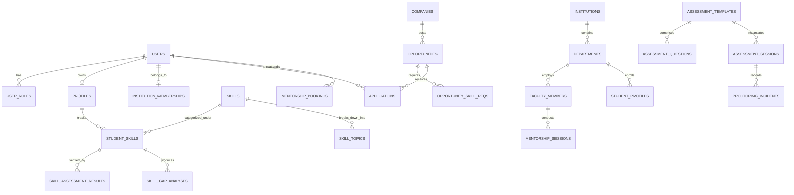

# Academia–Industry Collaboration Portal — Database Schema & Data Model Specification

## 1. Relational Architecture Overview

The database is powered by **PostgreSQL 17** (in production) and **Dolt SQL / MySQL** (in development and version-controlled environments). The schema contains over **90 normalized tables** organized into distinct domain boundaries:

---

## 2. Core Entity Tables & Data Dictionaries

### 2.1 Identity, Users & Roles
- **`users`**: Master user identity (`id`, `email`, `username`, `password_hash`, `role`, `status`, `institution_id`, `company_id`, `created_at`).
- **`user_tokens`**: Active refresh tokens and session metadata.
- **`profiles`**: Multi-role personal details (`first_name`, `last_name`, `phone`, `headline`, `bio`, `avatar_url`, `city`, `state`, `country`, `linkedin_url`, `github_url`).

### 2.2 Institution & Department Hierarchy
- **`institutions`**: AICTE-approved colleges/universities (`id`, `name`, `code`, `aicte_id`, `affiliation`, `address`, `website`, `verification_status`).
- **`departments`**: Academic units (`id`, `institution_id`, `name`, `code`, `hod_user_id`).
- **`faculty_members`**: Faculty registry (`id`, `user_id`, `institution_id`, `department_id`, `designation`, `specializations`, `max_mentees`).
- **`institution_students`**: Academic enrollment (`id`, `user_id`, `institution_id`, `department_id`, `roll_number`, `batch_year`, `semester`, `cgpa`, `placement_status`).

### 2.3 Skill Taxonomy & Verified Skill Profiles
- **`skills`**: Master taxonomy (`id`, `name`, `slug`, `category`, `domain`, `description`, `icon_url`).
- **`skill_topics`**: Fine-grained subtopics per skill (`id`, `skill_id`, `name`, `slug`, `order_index`).
- **`student_skills`**: Student skill mastery (`id`, `student_id`, `skill_id`, `declared_level`, `verified_level`, `is_verified`, `xp`, `verification_date`).
- **`skill_ranks`**: Deterministic rank ranking (`id`, `student_id`, `skill_id`, `global_rank`, `institution_rank`, `percentile`, `updated_at`).
- **`skill_gaps`**: Computed role deficiencies (`id`, `student_id`, `target_role`, `skill_id`, `required_level`, `current_level`, `gap_score`, `remediation_plan_json`).

### 2.4 Practice Arena, Challenges & Contests
- **`practice_questions`**: Problem bank (`id`, `title`, `slug`, `skill_id`, `topic_id`, `difficulty`, `question_type`, `content_json`, `solution_json`, `xp_reward`, `coin_reward`).
- **`question_submissions`**: Student practice attempts (`id`, `student_id`, `question_id`, `status`, `score`, `code_submission`, `execution_time_ms`, `attempted_at`).
- **`daily_challenge_sets`**: Curated 3-problem daily challenges (`id`, `challenge_date`, `questions_json`, `total_xp`).
- **`student_daily_challenges`**: Student challenge participation (`id`, `student_id`, `challenge_date`, `status`, `completed_at`, `streak_count`).
- **`revised_challenges`**: Auto-generated targeted challenges for weak topics identified during failed assessments (`id`, `student_id`, `skill_id`, `topic_id`, `weakness_score`, `status`).
- **`contests`**: Weekly coding and assessment contests (`id`, `title`, `start_time`, `end_time`, `rules_json`, `prize_pool_json`).
- **`contest_leaderboards`**: Live and finalized contest rankings.

### 2.5 Assessment & Dual-View Proctoring
- **`assessment_templates`**: Standardized and company-custom tests (`id`, `title`, `duration_minutes`, `passing_percentage`, `proctoring_level`, `created_by_company_id`).
- **`assessment_sessions`**: Executed test attempts (`id`, `student_id`, `template_id`, `status`, `score`, `passed`, `risk_score`, `started_at`, `submitted_at`).
- **`proctoring_incidents`**: AI-detected integrity violations (`id`, `session_id`, `incident_type`, `severity`, `confidence`, `timestamp`, `evidence_url`).
- **`dual_view_sessions`**: Paired companion device streams (`id`, `session_id`, `companion_token`, `status`, `device_info`).

### 2.6 Opportunities, Applications & Placements
- **`opportunities`**: Jobs, internships, hackathons (`id`, `company_id`, `title`, `type`, `mode`, `location`, `stipend_salary`, `deadline`, `status`).
- **`opportunity_skill_reqs`**: Explicit skill criteria (`id`, `opportunity_id`, `skill_id`, `min_level`, `is_mandatory`).
- **`applications`**: Student job applications (`id`, `opportunity_id`, `student_id`, `status`, `match_score`, `match_breakdown_json`, `applied_at`).
- **`campus_drives`**: Institution-partnered placement drives (`id`, `company_id`, `institution_id`, `drive_date`, `status`).

### 2.7 Mentorship, Projects & Community
- **`mentorship_sessions`**: Faculty and industry 1:1 / group slots (`id`, `mentor_user_id`, `title`, `scheduled_at`, `duration_mins`, `meeting_link`, `max_attendees`).
- **`mentorship_bookings`**: Mentee registrations (`id`, `session_id`, `student_id`, `status`, `notes`).
- **`collaborative_projects`**: Industry or faculty-led projects (`id`, `title`, `description`, `owner_user_id`, `status`, `max_members`).
- **`project_members`**: Student team roster and role assignments (`id`, `project_id`, `student_id`, `role`, `status`).

---

## 3. Indexing & Optimization Strategy

1. **Composite Performance Indexes**:
   - `idx_student_skills_student_skill` on `student_skills(student_id, skill_id)`
   - `idx_skill_ranks_skill_percentile` on `skill_ranks(skill_id, percentile DESC)`
   - `idx_applications_opp_match` on `applications(opportunity_id, match_score DESC)`
   - `idx_question_submissions_student` on `question_submissions(student_id, attempted_at DESC)`
2. **Deterministic Partitioning**:
   - `proctoring_incidents` indexed on `(session_id, timestamp)`.
